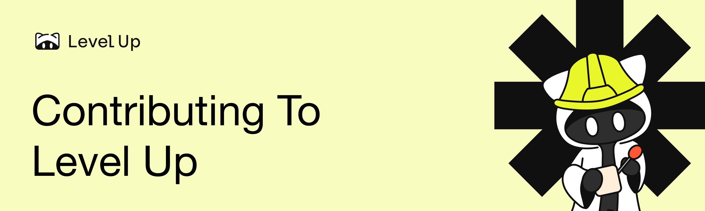

[](https://x.com/levelupweb3)
[](https://t.me/+PdNbk5milo1mMTAy)

Thank you for considering contributing to Level Up! We have been on a mission to build the best one-stop solution for developers to build the future of Ethereum. We greatly appreciate your help and are excited to collaborate with you. This document will guide you through the process of contributing.

# Contributing to Solidity Modules

At this time of writing, there are 25 Solidity modules available designed for aspiring developers as well as those looking to enhance their skills in Solidity.

## Adding Solidity Modules

1. Start a Discussion

   - Discuss new modules that you would like to see added into the Solidity curriculum.
   - Please utilise the template below when proposing a new module:

   ```
   🌟 Title of Module
   - Name of Solidity module

   🧠 Module Overview
   - Briefly describe key topics or concepts that the module will cover
   - How does this module complement or enhance current offerings?
   - Are there any overlaps with existing modules?

   📖 Learning Objectives
   - List the specific outcomes for this module. What should participants ideally be able to do upon successful completion?

   💭 Prerequisite
   - High-level description of the 5 levels of exercises which will be created. (Aim of exercises are to help devs level up their concept/coding proficiency via repetition in progressive difficulty.)

   🌐 Resources
   - Are there any resources that you would like to add to support the development of this module?
   ```

   > 📌 **Note:**
   > The discussion template has already been created [here](https://github.com/LevelUpWeb3/app/discussions/categories/solidity-module-ideas). You may directly start a discussion via the link above.

2. Level Up maintainer will review the discussion.
3. If suggestion is accepted, proceed with creating a PR to add the module. Name your branch as `solidity-"discussionTitle"` . Title of PR should ideally be `Add Solidity Module: "Discussion Title"` .
   - For example, if you are planning to create a module about Events, you can follow the following naming guide:
     - Branch name: `solidity-events`
     - PR Title: `Add Solidity Module: Events`
   - PR shall include exercises and solutions pair. The code can be referenced [here](https://github.com/LevelUpWeb3/app/tree/main/src/constants/solidity)
4. Keep commit messages short and concise to focus on change.
5. Ensure the Vercel checks passes.
6. Request for the maintainer to review the PR.
7. Your PR will be merged, amended, closed, or you will be asked for changes.

## Improving or Updating Solidity Modules

1. Fork this repo
2. Create a pull request (PR)
   - If improving or updating previous solidity module, name your branch with the `patch-solidity-"name"` prefix. Title of PR should ideally be `Patch Solidity: "Patch Name"`
3. Keep commit messages short and concise to focus on change.
4. Ensure the Vercel checks passes.
5. Request for the maintainer to review the PR.
6. Your PR will be merged, amended, closed, or you will be asked for changes.

# Contributing to Level Up Content

We welcome various types of content, primarily focused on the following categories:

- Zero-Knowledge Technology (ZK)
- Smart Contracts
- Decentralised Finance (DeFi)
- Attestation
- Protocol

We encourage contributions that explore these topics in-depth, in the form of articles, tutorials, guides and blog posts.

> 📌 **Note:**
> Please note that while these are the current categories we accept, we may update the categories depending on contributions and education needs. You may also propose new categories by creating a forum discussion [here](https://github.com/LevelUpWeb3/app/discussions/categories/content-ideas).

## Adding or Updating Content

1. Fork this repo
2. Create a pull request (PR)
   - If adding new content, name your branch as `content-"name"` . Title of PR should ideally be `Add Content: Name of Content`
   - If updating or fixing previous content, name your branch with the `patch-content-"name"` prefix. Title of PR should ideally be `Patch Content: "Patch Name`"
   - For example, if you are planning to create a content about building with circom, you can follow the following naming guide:
     - Branch name: `content-how-to-build-with-circom`
     - PR Title: `Add Content: How to Build with Circom`
3. Keep commit messages short and concise to focus on change.
4. Ensure the content builds on Vercel
5. Someone will review your PR
6. Your PR will be merged, amended, closed, or you will be asked for changes

## Content Standards

- Always include the metadata structure at the top of your content in the frontmatter:

```jsx
---
name: "Content Title";
index: 1; // This is for content indexing. Follow the next sequential number based on current repository.
summary: "Content Description"; // This appears in card description
author: "Your Name"; // A preferred name for us to credit you
authorIcon: "Link to your icon"; // GitHub or X icon link can be used here
authorLink: "Link to your profile"; // Can be any profile you want linked (GitHub, X, LinkedIn, Warpcast, etc.) but only one
published: "Mmm dd, yyyy"; // Date of article written
readTime: "xxx min read"; // Estimated read time in minutes
labels: ["Protocol"]; // Current options are ZK, Smart Contract, DeFi, Attestation and Protocol (labels can be more than one)
---
```

- If you touch any infrastructure, ensure the site builds with `yarn build`

# Contributing to Level Up Challenges

Level Up challenges are currently categorised into decentralised finance (DeFi) and NFT challenges, with difficulty levels ranging from Level 1 to 3, where Level 1 is the easiest and Level 3 being the most difficult.

We encourage contributions by hosting your code in the Level Up repository, allowing developers to learn and engage through your contributions.

> 📌 **Note:**
> Please note that while these are the current challenge categories, we may update the categories depending on contributions and education needs. You may also propose new categories by creating a forum discussion [here](https://github.com/LevelUpWeb3/app/discussions/categories/challenge-ideas)

## Adding Challenges

1. Start a Discussion

   - Discuss new modules that you would like to add into Level Up Challenges.
   - Please utilise the template below when proposing a new challenge:

```
   🌟 Title of Challenge(s)
   - List the name of the challenge(s)

   🧠 Challenge(s) Overview
   - Briefly describe the challenge(s).
   - What concepts or skills does it cover?
   - Are there any overlaps with existing challenges?

   📖 Learning Objectives
   - List the specific outcomes for this challenge(s).
   - What should participants ideally be able to do upon successful completion?

   💭 Prerequisite
   - High-level outline of required knowledge or skills needed before attempting this challenge.
   - Do they need to complete previous challenge(s)?

   📍 Category
   - Is this a DeFi or NFT challenge?
   - Or is this a new type of challenge which you would like to propose?

   🔥 Difficulty Level(s)
   - Select the difficulty level(s)
   - When building challenges, you do not need to create for all 3 levels

   🌐 Resources
   - Are there any resources that you would like to add to support the development of this challenge?
```

> 📌 **Note:**
> You can link content that you have created as a guide to the challenges you have developed.

1. Level Up maintainer will review the discussion.
2. If suggestion is accepted, the maintainer will create the repository in Level Up to host Challenges code. Repository title will be `discussionTitle-Challenge` . (See example here: https://github.com/LevelUpWeb3/0xSwapAPI-Challenge)
3. The maintainer will include you as a collaborator in the repository.
4. Proceed with creating a PR to add the challenge. Name your branch as `challenge-"discussionTitle"`. Title of PR should ideally be `Add Challenge: "Discussion Title"` .
   - For example, if you are planning to create a challenge about gaming, you can follow the following naming guide:
     - Branch name: `challenge-gaming`
     - PR Title: `Add Challenge: Gaming`
   - Include tests for your challenges, if applicable (not all challenges requires tests i.e. CTF Challenges)
5. Keep commit messages short and concise to focus on change.
6. Ensure the Vercel checks passes.
7. Request for the maintainer to review the PR.
8. Your PR will be merged, amended, closed, or you will be asked for changes.

## Improving or Updating Challenges

1. Fork this repo
2. Create a pull request (PR)
   - If improving or updating previous challenge, name your branch with the `patch-challenge-"name"` prefix. Title of PR should ideally be `Patch Challenge: "Patch Name"`
3. Keep commit messages short and concise to focus on change.
4. Ensure the Vercel checks passes.
5. Request for the maintainer to review the PR.
6. Your PR will be merged, amended, closed, or you will be asked for changes.

# Style Guide

- Use markdown to write content.
- **Bold** key terms or any terms the user must absolutely know when reading a doc.
- *Italicize* terms for emphasis but only when necessary.
- The introduction should inform the readers what they can expect from the content.
- Use a consistent voice. When writing documentation, avoid first person plural "we" and opt for second person singular "you".
- Be clear and concise. Avoid using filler words and redundant phrases.
  - Example of redundant sentence constructions: `You would think that this is really very important, but it is just the end result of X input`.
  - Example of clear writing: `The response from X input is not significant.`
