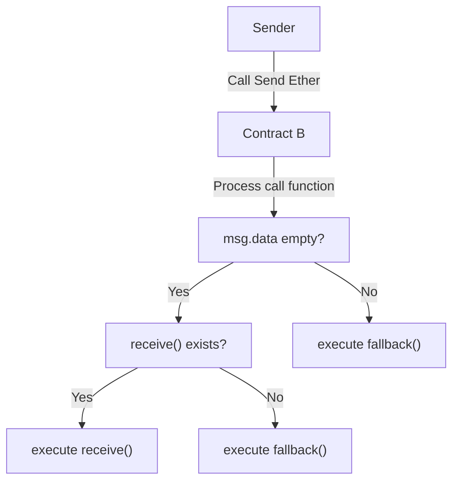

# Transacting Ether

Ether transactions comprises of two main parts: sending and receiving ether.

Recall that methods to transact ether revolves around `payable` keyword.

## Sending Ether

- `transfer` / `send` (NOT recommended due to 2300 gas limitations allowing potential reeentrancy attacks)
- `sendValue` [OpenZeppelin](https://docs.openzeppelin.com/contracts/2.x/api/utils#Address-sendValue-address-payable-uint256-)
- `call`

Recommended method is using `call` paired with reentrancy guard.

Simple example of sending Ether using `call` method:

```solidity
// SPDX-License-Identifier: MIT
pragma solidity ^0.8.24;

contract SendEther {

    address public sender;
    uint256 public amount;

    mapping(address => uint256) public balances;

    function sendViaCall(address payable _to) public payable {

        // Remember to update the balance before interactions prevent reentrancy attacks!
        // Follow Checks-Effects-Interactions pattern
        balances[msg.sender] -= amount;
        balances[to] += amount;

        // Call returns a boolean value indicating success or failure.
        // This is the current recommended method to use.
        (bool sent, bytes memory data) = _to.call{value: msg.value}("");
        require(sent, "Failed to send Ether");
    }
}
```

Using ReentrancyGuard:

```solidity
// SPDX-License-Identifier: MIT
pragma solidity ^0.8.24;

import "@openzeppelin/contracts/utils/ReentrancyGuard.sol";

contract SendEtherExample is ReentrancyGuard {
    constructor () ReentrancyGuard() {}

    // Event to emit when Ether is sent
    event EtherSent(address indexed to, uint256 amount);

    // Function to send Ether using the `call` method
    function sendEther(address payable recipient, uint256 amount) external payable nonReentrant {
        // Check that the contract has enough Ether to send
        require(address(this).balance >= amount, "Not enough Ether to send");

        emit EtherSent(recipient, amount);

        // Send the Ether and check that the call was successful
        (bool success, ) = recipient.call{value: amount}("");
        require(success, "Failed to send Ether");
    }

    // Function to check the contract's Ether balance
    function getBalance() external view returns (uint256) {
        return address(this).balance;
    }
}
```

If sending Ether <strong>after an effect</strong>, The recommended method to send Ether after an effect is using the [withdrawal pattern](https://docs.soliditylang.org/en/develop/common-patterns.html#withdrawal-pattern).

## Receiving Ether

Recall `payable` keyword when implementing an Ether receive function.

If a contract receives Ether (without a function being called), either the `receive() external payable {...}` or the `fallback` function is executed.

Ether will be rejected (by throwing an exception) if there are no `receive` or `fallback` functions.

```solidity
// SPDX-License-Identifier: MIT
pragma solidity ^0.8.24;

contract ReceiveEtherExample {
    // Event to emit when Ether is received
    event EtherReceived(address indexed from, uint256 amount);

    // Function to receive Ether
    receive() external payable {
        emit EtherReceived(msg.sender, msg.value);
    }

    // Fallback function
    fallback() external payable {
        // This function is called when no other function matches the called function,
        // or when someone just sent Ether without calling a function
        emit EtherReceived(msg.sender, msg.value);
    }

    // Function to check the contract's Ether balance
    function getBalance() external view returns (uint256) {
        return address(this).balance;
    }
}
```

Flowchart to determine `fallback` or `receive`:


